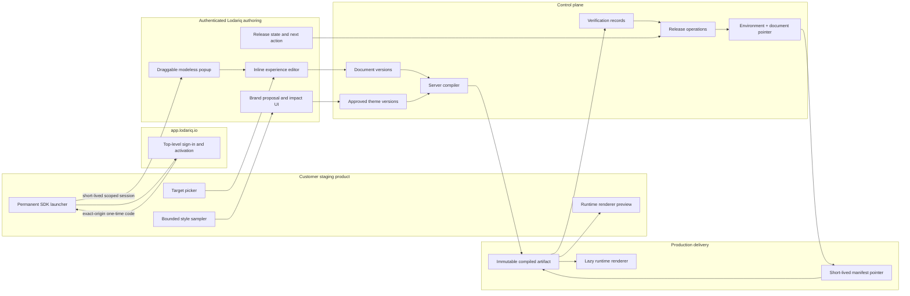

# Phase 2 In-Product Authoring, Brand, and Release Foundation Plan

Source of truth: `../../refined-lodariq-prd.md` §§5.1, 6.2.1, 7.3, 7.10, 9.4,
11.3, 16.4, and 20, plus ADR 0015, ADR 0016, and ADR 0017.

Status: **Local code milestone complete — Slice 0, the Editorial Air compatibility shell, Target
Identity V2, exact-area Tour-tooltip behavior, and Slice 1 hosted in-product
entry are locally verified. Slice 2's tokenized Tour renderer, persisted Brand
Theme workflow, document-specific delivery, deterministic basic preflight, and
guarded staging release workflow are implemented locally and passed their
consolidated local milestone gate and current-view Editorial Air Design QA. Core
Lodariq-owned authentication is code-complete and active runtime/dependencies
are Clerk-free. Slice 3's product matcher, provenance-backed mutable Brand
draft, exact 13-check browser verification, same-artifact production promotion,
and configurable zero-or-one-person approval are implemented locally. Slice 3
hardening and Slice 4 drift, recovery, unpublish, and analytics isolation are
also complete locally. The final repository checkpoint passes the full Node
24 `pnpm verify`: 18 typecheck tasks, 12 lint tasks, dependency boundaries and
migration safety, 126 Vitest files / 1,064 tests, 11 builds,
runtime/authoring bundle-size gates, 109 prepared SDK assets, 77 Playwright
tests with four intentional skips, and a zero-vulnerability dependency
audit. First deployment, production enablement, live RLS/smoke/convergence
evidence, the B4 measurement-backed ADR, and external usability evidence
remain unclaimed**

Estimated roadmap window: weeks 16-25 after adding hosted SDK-first creator
entry as Slice 1.

Last updated: 2026-08-09

Current technical execution moved to
[`phase-2-technical-completion.md`](phase-2-technical-completion.md). That plan
records the completed local Slice 3/4 work and retains the first clean-slate
deployment and B4 measurement decision as operational follow-up; point 5
product research and paid pilots are explicitly excluded.

Selected visual direction: Option 2, **Editorial Air**, documented in
`../product-design/design-system-exploration-2026-08-06/README.md`. It is the
current canonical direction for dashboard hierarchy and hosted creator chrome;
the Slice 2 structural comparison passes at the current in-app browser viewport,
while generated branding and exact pixels remain illustrative pending later
brand-native and usability evidence.

## Outcome

Phase 2 makes the existing tour workflow look native automatically and move
safely from staging to production. A creator should be able to:

1. Open the customer's staging product and activate Lodariq directly from the
   permanently installed SDK launcher.
2. Sign in on Lodariq's first-party origin when required, then return to the
   same page without a dashboard detour.
3. Create, open, or preview a tour in place.
4. Receive an accessible brand-native appearance without CSS.
5. Publish one immutable version to staging.
6. Verify the real staging behavior.
7. Promote that exact artifact to production without recompilation.
8. Detect target or brand drift and restore a previous release when necessary.

The phase does not expand into every planned experience type. It establishes
shared Brand System, renderer, release, and health contracts that later types
must pass.

## Product Invariants

- The live customer product is the primary creator workspace.
- One permanent SDK installation is the canonical authoring and delivery path;
  no extension, second creator snippet, or daily dashboard launch is required.
- Development/staging bootstrap may expose a small launcher activation
  descriptor. Production bootstrap exposes neither launcher nor authoring URLs.
- Creator authentication happens in a top-level first-party Lodariq popup;
  account credentials never enter the customer page, while short-lived
  bootstrap, activation, and session grants stay only in memory and out of
  URLs, DOM attributes, persistent storage, and logs.
- The launcher and authoring popup are draggable and modeless. The page outside
  visible popup bounds remains interactive; target selection collapses and
  restores the popup without losing state.
- Canonical state remains structured Lodariq block JSON.
- `@lodariq/schema` TypeBox/JSON Schema is the cross-system contract.
- Preview and production use the same runtime renderer behavior.
- Real artifacts compile server-side; browser compilation remains preview-only.
- Every artifact pins its document version, theme snapshot, compiler version,
  and renderer contract version.
- Product-style sampling loads only for authenticated creators.
- No arbitrary CSS, JavaScript, raw HTML, DOM snapshots, or stylesheet copies.
- Newly authored Target Identity V2 values contain no CSS selector, class list,
  raw style, URL, DOM/HTML snapshot, screenshot, or absolute rectangle. Phase 1
  fingerprint CSS remains read-only compatibility only.
- Live rectangles are normalized into viewport/state-scoped,
  container-relative topology and recomputed from the current render. Geometry
  and locale-scoped text are supporting evidence only and never production
  interaction triggers.
- A target needs at least two independent durable nonvisual evidence families,
  a strict winner, and a sufficient runner-up margin. Production fails closed
  when evidence is missing, ambiguous, drifted, or unverified.
- Active deployment identity is `(workspaceId, environmentId, documentId)`.
- Publishing compiles; promotion and rollback never compile.
- Documents and themes are never copied per environment.
- Token creation, editor launch, and authoring-session creation never publish.
- Production never loads authoring, sampling, React, or Lexical code.

## Current Baseline and Known Gaps

Useful foundations already exist:

- Pure content-addressed compilation in `@lodariq/compiler`.
- Closed TypeBox canonical document, block, target, trigger, audience, bridge,
  and publish contracts.
- Closed semantic Brand Theme, theme binding, experience appearance, renderer
  version, V2 compiled-artifact, and document-deployment contracts.
- Exact-origin, runtime-validated, batched iframe bridge.
- Selector-free Target Identity V2 contracts, one-click authoring capture, and
  an independent-evidence runtime resolver are implemented in the current
  working milestone; immutable Phase 1 fingerprints remain readable.
- Runtime-backed tour preview through `TourPlayer`.
- Environment rows/tokens and server-side publish endpoint.
- Immutable compiled-artifact insertion/readback and publication records.
- A `document_deployments` schema and repository foundation keyed by workspace,
  environment, and document, with generation and active/inactive state. It is
  included in the clean-slate initial baseline, which has not been applied to an
  external database.
- A non-public activation repository boundary with persisted release operations,
  validation and comparison of a caller-supplied request hash, expected-generation
  compare-and-swap, transactional advisory locking, and replay/conflict behavior.
- Production authoring prohibition and runtime bundle gates.
- A local draggable/modeless popup, persistent launcher, compact tour sequence
  rail, inline editing, and target-selection collapse behavior.
- Nested icon/text/SVG selection normalization, immediate reliable attachment,
  bounded passive stability/uniqueness sampling, normalized rendered-topology
  variants, locale-aware page context, and factual target states are present in
  the current working milestone.
- Target-bearing Tour tooltips now support a whole-element default plus
  progressively disclosed exact point/region presentation anchoring. The
  authoring picker, compiler, and runtime all resolve the real owner first;
  normalized geometry positions Lodariq UI only.
- The one permanent public SDK installation now resolves exact trusted origins,
  keeps its development/staging-only launcher hidden until keyboard/dashboard
  reveal, and keeps production closed.
- Hosted entry now uses the stable **New experience**, **Experiences on this
  page**, **Preview as user**, and **Hide Lodariq** actions. New exposes only Tour. Browse is
  draft-free until selection, receives only a normalized pathname, supports
  explicit page/workspace scope, search, empty/release-truth states, and opens
  the selected document in place.
- The hosted browse and editor shells are draggable, viewport-safe, modeless,
  and coordinated with the launcher. Close revokes activation/session state;
  **Save & exit** first flushes the latest draft. Credentials stay in memory and
  the exact editor iframe owns the document-session bearer.
- The dashboard lists one-install configurations, synchronizes trusted origins
  atomically, opens the configured product instead of preparing a daily handoff,
  and permits installation mutation only for admins/owners. Other workspace
  roles receive read-only inspect/copy controls through provider-neutral auth
  context.
- The active API/dashboard runtime and dependency graph are Clerk-free. Owned
  Argon2id password credentials use the established `argon2` package with
  `m=65536`, `t=3`, `p=1`, and a 32-byte hash; unknown accounts receive
  equivalent dummy work behind a bounded admission gate. Hash-stored
  opaque sessions, secure first-party cookies, purpose-separated verification/
  reset challenges, generic recovery, the unified leased outbox/Resend worker,
  database-backed rate limits, workspace create/select with session rotation,
  membership resolution, API+BFF capability gates, dashboard recovery/reset,
  and activation reset-then-retry UX are implemented and pass the consolidated
  local milestone gate.
- Slice 3 implements authenticated authoring-only product-style sampling,
  explicit SDK Brand-token registration, bounded semantic evidence, confidence
  and confirmation, and persisted provenance applied to the mutable workspace
  theme draft without mutating an approved theme or live artifact.
- Slice 3 also implements content-addressed exact-artifact loading and a closed
  13-check browser report. Verification resolves every target referenced by a
  compiled step and binds acceptance to the authenticated session, exact
  allowlisted origin, active publication identity, artifact/theme hashes, and
  renderer contract.
- Production promotion now reuses the exact verified staging artifact with no
  compiler call. A workspace may require either zero approvals or one explicit
  approval; requesting approval never approves or promotes implicitly.

The implemented Slice 0 foundation also changes the compiler boundary to require an explicit
theme snapshot and renderer contract version. V2 artifact hashing covers the
theme and renderer contract, and the fallback theme is versioned and frozen.
Environment-token creation and authoring-session/editor launch no longer
publish implicitly.

Phase 2 must still correct these limitations before the complete Brand and
release UX is enabled:

- The Slice 1 entry/session path is locally verified but not yet proven against
  deployed staging, live exact-origin infrastructure, production network traces,
  or an initialized shared database.
- The owned-auth code milestone is not yet a production account cutover. Public
  signup/recovery remain disabled until `0000_initial_baseline.sql` initializes
  an approved empty Neon target, the non-owner RLS verifier passes, the Resend
  domain and secrets are configured, API and dashboard capability flags are
  enabled together, and deploy/live probes pass.
  Invitations/member-role administration remain later product work.
- Workspace theme drafts, immutable approval versions, first-approved default
  selection, explicit default changes, document binding/acknowledgement, impact
  views, and capability-gated Brand dashboard APIs are implemented locally.
  Product sampling, registered-token ingestion, provenance/confidence, creator
  confirmation, and mutable-draft application are now implemented locally.
  The editor must still refresh its in-memory preview from the returned mutable
  theme draft immediately after Product Match.
- The Tour renderer now consumes the compiled semantic theme recipe in delivery
  and runtime-backed preview. The current-view comparison passes Editorial Air
  structural conformance; local Product Match now supplies semantic Brand
  proposals, while deployed brand-native and design-partner evidence remains
  open.
- Document-specific direct and hosted authoring delivery are implemented against
  an exact approved theme and renderer contract. Live database/deployment and
  multi-document runtime browser evidence remain open.
- Direct and hosted release-state reads plus guarded staging publication are
  implemented. The server derives the request hash, requires idempotency and
  expected-generation CAS, checks capabilities, runs deterministic basic
  preflight, and advances only the reviewed document artifact.
- The legacy `/v1/documents/:documentId/publish` mutation is closed; it is not a
  development/staging release path. Exact staging verification, same-artifact
  production promotion and rollback, unpublish, configurable release policy,
  and complete recovery history are implemented locally.
- Product Match commits the mutable draft and complete bounded provenance set in
  one idempotent, CAS-protected transaction and returns the exact persisted
  preview receipt.
- SDK analytics derives publication/environment identity from the active
  server-side pointer, persists it under forced RLS, and queries one environment
  at a time.

This is the completed local Phase 2 code foundation. It does **not** claim
deployed/live entry or external-database evidence, production auth enablement,
deployed exact-browser/release convergence, a measurement-backed publication
materialization decision, or external usability evidence.

### Editorial Air Compatibility-Shell Checkpoint — 2026-08-06

This dated checkpoint records the first cross-surface implementation pass. At
that point it passed the consolidated repository gate but had not yet converged
hosted entry and still awaited same-viewport Design QA:

- The dashboard uses Editorial Air's light-first navigation, release-led
  overview, environment progress, and recent-activity hierarchy. Setup,
  installation, document, Brand, environment, and support capabilities remain
  available behind focused destinations instead of competing on the home view.
- Desktop navigation starts as a compact icon rail and expands in place to show
  destination labels. Mobile navigation is a modal drawer opened from the
  header and never degrades into a horizontal tab or scrolling navigation strip.
- The local/in-product authoring surface uses the compact draggable modeless
  popup, restrained-glass evergreen creator chrome, opaque warm-white editing
  body, minimize/restore behavior, and target-selection collapse/restore.
- At this checkpoint, local creator mode implemented the canonical icon actions **New
  experience**, **Experiences on this page**, and **Preview as user** with a
  Tour-only distinct-draft flow and route-scoped local list. The hosted
  compatibility path retained **Edit current experience** and **Preview as
  user** until first-party activation supplies equivalent create/list/open
  capabilities.
- Dashboard release rows describe recorded publication history and derived
  readiness only. They do not assert an active production pointer, verified
  staging state, promotion, rollback, or any other release mutation that the
  current public workflow cannot prove.

This historical checkpoint was visual and interaction-shell alignment, not
hosted-entry convergence. It did **not** implement or prove the permanent-loader activation
descriptor, first-party authentication popup, exact-origin single-use exchange,
iframe-owned document session, document-specific delivery, Brand persistence,
or release mutation. The later verified Slice 1 checkpoint below supersedes its
hosted-entry limitation; the historical evidence itself remains unchanged.

### Target Identity V2 Code Checkpoint — 2026-08-07

The selector-free target-reliability milestone is implemented in code and
passed its consolidated Node 24 verification on 2026-08-07:

- `TargetIdentityV2` and privacy-safe verification observations are closed
  TypeBox contracts. The compiler preserves V2 identity in the immutable
  artifact and rejects a mismatched outer/identity target ID.
- New capture persists no CSS selector. The optional Phase 1
  `ElementFingerprint.scopedCss` field remains readable only for legacy
  artifacts and is a small legacy ranking hint, never a V2 fallback. The
  compiler strips it and diagnostic coordinates from targets carrying V2
  identity.
- A single click normalizes nested visual nodes to the meaningful control,
  attaches usable captures immediately, and passively samples bounded
  stability/uniqueness before sending one debounced semantic evidence update.
  Only weak or ambiguous capture needs a compact creator decision.
- `getBoundingClientRect()` is used only to derive and later recompute coarse
  size/aspect, semantic-container-relative center, container ratio, and spatial
  relation evidence. Viewport center is not enforced when no meaningful
  container exists. One-click capture records the current viewport variant;
  the schema/resolver also support an explicit state-scoped variant. Raw
  rectangle coordinates are not V2 identity and cannot trigger an interaction.
- Runtime resolution requires visibility/action/context gates, at least two
  durable nonvisual evidence families, a confidence floor, and a strict margin
  over the runner-up. Locale-scoped text and rendered topology can support
  diagnostics/ranking but cannot satisfy the durable minimum, clear a durable
  tie, or veto a uniquely resolved durable target. V2 health score buckets use
  durable evidence only.
- Runtime and authoring surfaces use **Verified**, **Drift detected**,
  **Ambiguous**, **Missing**, and **Unverified** states and withhold a target or
  rendered tour card when resolution is unsafe. The authoring publish-readiness
  path can require verified targets.
- A zero-marker fixture includes a target with no ID, class, `data-*`, or
  Lodariq attribute, plus nested visual nodes, localization, complete node
  replacement, responsive reflow, and a similar distractor.
- The complete gate passed 42 unit-test files/415 tests and 59 browser tests,
  with four planned browser skips, plus typecheck, lint, dependency boundaries,
  migration safety, builds, bundle-size checks, SDK CDN asset preparation, and
  the security audit.

This checkpoint does **not** yet provide persisted environment/artifact
verification history, a target-issue queue, approved repair revisions,
scheduled authenticated browser checks, or a screenshot/pixel verifier. A
later pixel verifier is optional, permissioned extension/automation work and is
not a dependency of the SDK resolver or canonical authoring path.

### Exact-Area Tour-Tooltip Presentation Checkpoint — 2026-08-07

The following behavior is implemented in code with focused schema, compiler,
authoring, runtime, and browser coverage:

- Closed `PresentationAnchor` and `ExactPresentationAnchor` contracts accept a
  whole-element default, normalized point, or positive in-bounds region. Semantic
  validation rejects overflow that JSON Schema cannot express alone.
- Canonical Tour authoring stores the optional anchor on the target-bearing
  tooltip. The compiler rejects any other ownership, strips geometry from body
  props, and lifts it beside the target binding as
  `CompiledStep.presentationAnchor`.
- **Use exact area** collapses the modeless popup and supports pointer click for
  a point, pointer drag for a region, arrow keys plus `Enter` for a point, and
  `Escape`/Cancel without mutation. **Use whole element** removes the override.
- Correlated start/result/cancel bridge messages reject stale block, target, and
  request combinations. Replacing or removing the owning target clears its old
  presentation geometry.
- The host resolves the owner before selection and re-resolves the same owner
  before commit. The runtime resolves the owner before rendering, projects the
  ratios onto fresh live bounds, follows scroll/resize/layout changes, and
  withholds the card when the owner disappears, becomes hidden, or no longer
  resolves safely.
- A point/region may position Lodariq Tour-tooltip UI only. Product click/focus
  behavior remains attached to the freshly resolved real owner; geometry never
  creates a candidate, calls `elementFromPoint()`, or triggers customer UI.

This checkpoint does not implement exact-area spotlight/hotspot rendering or
crop behavior and does not complete Phase 2. At the time of this dated entry its
combined gate was pending bundle-size cleanup; the later consolidated Slice 1
gate below includes and verifies this exact-area implementation.

### Slice 1 Hosted In-Product Entry Checkpoint — 2026-08-07

Slice 1 is code-complete and locally verified:

- The permanent public installation resolves exact configured origins, exposes
  the lightweight launcher only on authoring-enabled development/staging pages,
  and leaves production bootstrap free of creator metadata and authoring code.
- The draggable launcher uses the stable **New experience**, **Experiences on
  this page**, and **Preview as user** icon actions with tooltips, 44-pixel
  targets, pinning, keyboard movement, explicit collapse, and minimize/restore
  coordination with the hosted surface. New exposes only Tour.
- Browse opens without creating a draft, sends only a normalized pathname,
  scopes results to the current page by default, expands to same-workspace scope
  only through **Browse all**, and includes search, empty, release-truth, and
  explicit start/open states.
- The hosted browse and editor shells are bounded, draggable, viewport/safe-area
  aware, modeless, and exact-origin validated. Close revokes activation/session
  state and may drop only unsaved iframe changes; prior autosaves remain. **Save
  & exit** flushes and persists first, then revokes.
- The dashboard/API provide a single public installation view, atomic trusted-
  origin synchronization, revalidation after create/sync/revoke, **Open your
  product** entry, and provider-neutral auth context. Admins/owners mutate;
  members/viewers receive read-only inspect/copy behavior.

The consolidated local gate passed: dependency installation completed with an
expected Node 22 versus required Node 24 warning; changed-package and workspace
typechecks, lint, dependency boundaries, migration safety, 55 test files/581
tests, all 11 builds, every listed bundle-size budget, 58 prepared SDK assets,
and the security audit with zero known vulnerabilities passed. After two stale
browser assertions were corrected, all 62 executed E2E tests passed with four
planned skips.

At the Slice 1 checkpoint, this was not full Phase 2 or deployed/live
acceptance. Same-viewport Editorial Air Design QA, an initialized live database/RLS
exercise, CDN/Fly staging and production traces, external usability evidence,
Brand/release work, and document-specific delivery still remained. The later
Slice 2 checkpoint below supersedes only those local implementation gaps. The
Clerk-free owned-auth code milestone, including recovery and email-worker
behavior, passes; production enablement and live cutover remain an operational
gate.

### Slice 2 Brand-Native Staging Tour Checkpoint — 2026-08-08

Slice 2 is implemented locally and its consolidated milestone and current-view
visual gates pass:

- The delivery renderer and authoring preview share the tokenized Tour renderer
  and consume the compiled semantic Brand Theme recipe, appearance preset,
  density, width, and color mode instead of a separate preview skin.
- Workspace theme drafts, optimistic revision guards, immutable approval
  snapshots, first-approved default selection, explicit default changes,
  document binding/acknowledgement, and impact views are persisted and exposed
  through capability-gated API/dashboard controls.
- Direct and hosted authoring return the document with the exact approved theme
  version and pinned compiler/renderer/theme contract. Document-specific SDK
  delivery no longer depends on the ambiguous environment-global current-
  document fallback.
- Direct and hosted release-state surfaces derive the staging action from saved
  artifact and pointer truth. Staging publication accepts only the configured
  staging environment and a reviewed immutable artifact; the server derives the
  canonical request hash and enforces idempotency, expected-generation CAS,
  membership/session capability checks, and append-only release history.
- The deterministic DOM-free preflight validates artifact/theme identity,
  renderer compatibility, semantic contrast, long-copy risk, and estimated
  density at 320 px. Browser/runtime target, font, clipping, stacking, RTL,
  and zoom verification were deferred to Slice 3 at this checkpoint; optional
  permissioned pixel comparison remains later automation work.
- The Slice 2 database schema added authoring-session compatibility pins, theme
  drafts, immutable versions, visual-check runs, scoped indexes, and forced RLS.
  That dated development work is now folded into `0000_initial_baseline.sql`,
  which creates no historical rows and performs no backfill.

Verification evidence:

- Full browser E2E: **62 passed, four intentional dashboard cross-browser
  skips, zero failures** across Chromium, Firefox, and WebKit.
- Affected unit regression set: **42/42 passed**. The prior full
  unit/integration gate remains **724/724 passed**.
- Schema, authoring, and tests typechecks; relevant lint; schema and authoring
  builds; authoring size budgets; and the security audit all passed.
- The current-view structural comparison against Option 2, **Editorial Air**,
  passed using
  `../product-design/implementation-captures/editorial-air-dashboard-slice2-qa.png`,
  `../product-design/implementation-captures/editorial-air-authoring-panel-slice2-qa.png`,
  and
  `../product-design/implementation-captures/editorial-air-slice2-comparison.png`.
  The collapsed-by-default desktop navigation, progressive disclosure, and
  icon-only launcher actions are intentional later approved decisions, not
  regressions from the concept image.

At this Slice 2 checkpoint, product-style sampling, registered token ingestion,
provenance/confidence, exact staging browser verification, and production
approval/promotion were not yet implemented. The later Slice 3 checkpoint below
supersedes those local implementation gaps; rollback/unpublish, analytics
isolation, live database/deployment evidence, and external usability evidence
remain open.

### Slice 3 Match Product and Exact Promotion Checkpoint — 2026-08-08

Slice 3 is implemented locally in four bounded capabilities:

- The authenticated authoring host provides a bounded style sampler and the SDK
  exposes explicit semantic Brand-token registration. Sampling waits for
  document/route readiness, fonts, and stable frames; it persists no raw CSS,
  selectors, class names, DOM/HTML, URLs, screenshots, or coordinates.
- Product Match records normalized source provenance and confidence, requires
  confirmation for weak inference, and applies accepted tokens only to the
  mutable workspace-theme draft. Approved snapshots and published artifacts
  remain immutable.
- Exact staging verification loads and re-hashes the content-addressed artifact
  and theme, runs the closed 13-check browser report, and resolves every target
  referenced by compiled steps. Publication, workspace, environment, actor, and
  exact-origin identity are server/session-derived and fail closed on mismatch.
- Production promotion reuses the verified staging publication's exact artifact,
  content hash, theme snapshot, and renderer contract without recompilation.
  Environment policy supports no approval or one explicit approval; an approval
  request never counts as an approval or promotes by itself.

Repository completion checkpoint (2026-08-09): The full Node 24
`pnpm verify` passes 18 typecheck tasks, 12 lint tasks, dependency boundaries and
migration safety, **126 Vitest files / 1,064 tests**, 11 builds, the
runtime/authoring bundle-size gates, 109 prepared SDK assets, 77 Playwright tests
with four intentional skips, and `pnpm audit` with zero known vulnerabilities.

Immediate preview refresh, atomic Product Match persistence, complete compact
finding presentation, Brand drift/acknowledgement, guarded rollback/unpublish,
and analytics isolation are complete locally. Live database/RLS and deployment
proof, production auth enablement, the B4 measurement-backed ADR, and
PMM/design-partner usability evidence remain open.

## Target Architecture



## Workstream A — Canonical Contracts

Add centralized TypeBox schemas and inferred types, all with
`additionalProperties: false`:

- `BrandThemeSnapshot`
- `ThemeTokens`, modes, shadow layers, and renderer recipes
- `ThemeBinding` and semantic `ExperienceAppearance`
- `CustomerBrandTokenRegistration`
- `CapturedStyleSample` and provenance/confidence
- `VisualPreflightReport` and centralized issue codes
- `EnvironmentReleasePolicy`
- `DocumentDeployment` and deployment state
- `ReleaseOperation`, action, and status
- `PublicationVerification`
- `ReleaseApproval`
- Versioned active/inactive `ManifestPointer`
- Public `SdkInstallation`, exact-origin `EnvironmentResolution`, short-lived
  bootstrap grant, and a closed production-disabled/authoring-available
  activation descriptor
- `AuthoringAuthorizationRequest`, single-use authorization result/exchange,
  scoped `AuthoringSessionContext`, capability set, expiry, consumption, and
  revocation records

One public installation ID is embedded in the application shell. It is not a
bearer secret; the API resolves the exact request origin to one configured
environment and returns a narrow short-lived bootstrap grant. Existing
environment-token snippets remain compatibility input during migration, not
the final installation contract.

Deprecate `AudienceDefinition.environments`. Product environment is deployment
state, not an audience condition. Existing documents remain readable during
migration, but new writes keep audience eligibility and release destination as
separate contracts.

Centralize every value set and creator-facing label in constants/maps. Avoid
nested switch statements so future renderers and release actions extend one
obvious registry.

### Theme contract boundaries

The first contract accepts:

- Normalized solid sRGB colors.
- Safe font-family names without URLs.
- Bounded numeric typography, spacing, radius, sizing, border, and motion.
- Structured shadow layers.
- Light mode and optional dark mode.
- Known recipes and semantic variants for shipped renderers.

It rejects CSS selectors/declarations, `var(...)`, URLs, arbitrary custom
properties, unknown token keys, gradients in v1, animation names, and unsafe
properties such as image/filter/mask/content/cursor.

### Document appearance migration

Replace new writes of string-only `themeRef` with:

```ts
type ThemeBinding =
  | {
      policy: 'workspace-current';
      themeId: string;
      acknowledgedThemeVersionId: string;
    }
  | {
      policy: 'pinned';
      themeId: string;
      themeVersionId: string;
    };
```

Legacy documents remain readable. A document without a theme resolves to a
versioned Lodariq accessible fallback, never an unversioned mutable default.

## Workstream B — Brand System

### B1. Renderer parity

- Change the compiler input to require an explicit validated theme snapshot and
  renderer contract version.
- Embed that snapshot in compiled JSON and cover it with the artifact hash.
- Replace hardcoded tour appearance with structural CSS plus controlled CSS
  variables and enum-to-recipe mappings.
- Serialize only known property names and parsed values; never concatenate
  creator strings into CSS syntax.
- Keep authoring preview on the actual `@lodariq/sdk-runtime` tour renderer.
- Pin compatible compiler, renderer, and theme contract versions in authoring
  sessions and manifests.

### B2. Workspace themes

- Add theme drafts and immutable approved theme versions.
- Apply the approved workspace theme automatically to new experiences.
- Support narrow presets: default, accent, inverse, success, warning, minimal.
- Support density, width, and light/dark/system choices.
- Show explicit inheritance and local-override badges.
- Before approving a shared change, show affected documents/renderers and a
  before/after runtime preview.
- Theme approval never republishes documents automatically.

### B3. Match product

Slice 3 reuses the target-picker architecture for an authenticated,
authoring-only style sampler.

When `Match product` runs:

- Reuse the experience target when available; otherwise ask for one element.
- Sample body typography/background, the selected element, up to six ancestors,
  and no more than twenty nearby visible semantic controls.
- Wait for route readiness, `document.fonts.ready`, and two stable animation
  frames.
- Read only allowlisted resolved computed values.
- Normalize to semantic roles and discard raw CSS, selectors, class names,
  HTML, URLs, and diagnostic coordinates.
- Prefer explicit SDK tokens, then selected elements, then bounded inference,
  then Lodariq defaults.
- Require confirmation before low-confidence inference replaces an approved
  token.

Add an explicit customer API:

```ts
Lodariq.registerBrandTokens({
  schemaVersion: '1',
  sourceId: 'customer-design-system',
  revision: 'token-build-id',
  modes: {
    light: {
      colors: { accent: '#2457ff', onAccent: '#ffffff' },
      typography: { fontFamilies: ['Customer Sans', 'system-ui'] },
    },
  },
});
```

The exact-origin resolved environment can expose registered values only to a
short-lived authoring session. A public installation ID, bootstrap grant, or
compatibility environment token cannot persist or approve a workspace theme;
that requires an authenticated admin capability.

Extend the canonical bridge union with semantic, acknowledged messages:

```text
style.sample.start
style.sample.result
style.sample.canceled
brand.tokens.available
theme.preview.patch
visual.preflight.result
```

Pointer movement and computed-style work remain in the host bridge. Only one
normalized, size-bounded sample crosses after selection. Existing protocol
version, exact origin, session/document scope, timeout, acknowledgement, and
runtime validation rules remain mandatory.

This flow is implemented locally, including explicit registered-token priority,
semantic source fingerprints, confidence, low-confidence confirmation, and
mutable theme-draft application. The accepted proposal never mutates an
approved snapshot or live artifact. Immediate preview rehydration from the
returned draft and atomic source-plus-draft persistence remain follow-ups.

### B4. Visual preflight and drift

Slice 2 implements the deterministic, DOM-free subset:

- Artifact/theme schema and content-hash identity.
- Renderer-contract compatibility.
- Semantic text, control, and focus-color contrast.
- Long-copy risk and estimated density at a 320 px viewport.

Slice 3 implements an exact, closed 13-check browser report containing each code
exactly once: artifact integrity, renderer readiness, all referenced targets
resolved, overflow, primary-action clipping, target collision, font fallback,
stacking context, responsive widths, dark mode, RTL, reduced motion, and 200%
zoom. Aggregate pass/warning/fail status must agree with those checks.

The verifier loads and recomputes the hashes of the exact active staging
artifact and theme, renders through the real runtime, and fails closed when any
target referenced by any compiled step cannot be resolved. Coordinates remain
diagnostic only. The server derives publication/workspace/environment/actor
identity and accepts evidence only from the exact allowlisted origin and scoped
authoring capability.

Block only unsafe or unusable results. Missing optional fonts and preferred
layout differences can remain warnings when fallback behavior is accessible.

Brand drift compares normalized fingerprints rather than CSS files or
screenshots. It proposes a new theme draft; it never changes the active theme or
live artifacts automatically.

### B5. Brand persistence and API

Add workspace-scoped, forced-RLS tables:

```text
themes
  id, workspace_id, name, draft_json, active_version_id
  created_by, updated_by, created_at, updated_at

theme_versions
  id, workspace_id, theme_id, version
  schema_version, contract_version, canonical_json, content_hash
  approved_by, approved_at, created_at

style_sources
  id, workspace_id, theme_id, environment_id, purpose
  semantic_fingerprint_json, normalized_sample_json
  sample_hash, confidence, captured_at

visual_check_runs
  id, workspace_id, document_id, document_version_id
  compiled_artifact_id, theme_version_id, environment_id
  content_hash, report_json, status, created_by, created_at
```

Add `theme_version_id`, `theme_content_hash`, and
`renderer_contract_version` to compiled artifacts.

The Slice 2 implementation checkpoint added `themes`, immutable
`theme_versions`, and `visual_check_runs` with scoped indexes and forced RLS;
compiled artifacts and authoring sessions pin the exact theme/renderer identity.
The Slice 3 checkpoint added forced-RLS `style_sources`,
`publication_verifications`, and `release_approvals` records. All are now part of
`0000_initial_baseline.sql`. Product Match
persists normalized provenance/confidence and updates the mutable theme draft;
the draft update and source inserts still need one atomic transaction before
live enablement.

Control-plane routes:

```text
GET    /v1/themes
POST   /v1/themes
GET    /v1/themes/:themeId
PATCH  /v1/themes/:themeId/draft
POST   /v1/themes/:themeId/approve
GET    /v1/themes/:themeId/impact
POST   /v1/themes/:themeId/style-sources
POST   /v1/themes/:themeId/drift-checks
POST   /v1/documents/:documentId/visual-check-runs
GET    /v1/documents/:documentId/visual-check-runs
```

The Slice 2 API implements theme list/create/detail, guarded draft update,
approve/default, document binding/acknowledgement, impact, and internal
preflight persistence. Slice 3 adds direct and hosted style-source application
plus exact publication-verification submission/history. Drift routes and
scheduled/general visual-check automation remain Slice 4 or later.

Theme approval and workspace-default changes require an admin capability.
Creators may submit proposals and choose approved themes/presets. Persistent
writes from the customer page require a short-lived scoped authoring session.

## Workstream C — Environment Release Pipeline

### C1. Environment configuration

Keep one development/staging/production environment per workspace initially.
Extend each with:

- Display name, enabled state, and pipeline position.
- Exact normalized origins.
- `authoringEnabled` with production forced false.
- Promotion source environment.
- Direct-publish, verification, approval, publisher, rollback, and separation
  policy.

Use explicit capabilities rather than a generic role comparison:

- Member: edit and publish/verify non-production.
- Admin: configure environments and promote/rollback/unpublish production.
- Owner: all capabilities and policy changes.

### C2. Per-document deployment pointer

Add:

```text
document_deployments
  workspace_id
  environment_id
  document_id
  active_publication_id nullable
  pending_release_operation_id nullable
  generation integer not null
  state active | inactive
  updated_at
  primary key (workspace_id, environment_id, document_id)
```

This replaces the environment-global "current document" assumption. Publishing
document B must never change document A.

Slice 0 established this table and schema locally. Slice 2's
guarded staging route now advances the matching workspace/environment/document
pointer. Reads support explicit document lookup;
the old environment-global compatibility lookup is used only when no deployment
pointers exist, returns the sole active document when exactly one exists, and
fails deterministically when multiple are active. Document-specific direct and
hosted delivery are implemented locally; external-database/live browser evidence remains
pending.

### C3. Release records

Keep artifacts and publications immutable. Add release operations,
verifications, and approvals as specified in PRD §11.3. Publications record
publish/promote/rollback provenance. Unpublish records an operation and inactive
pointer without deleting history.

Artifact insert-on-conflict must read the existing immutable row rather than
update its metadata.

Slice 0 established immutable insert/readback, repository pointer advancement,
and append-only publication/release-operation records.
Successful guarded publications record their action, release operation, and
previous active publication; legacy rows remain nullable. Repository-only
activation validates and compares a caller-supplied request hash and enforces
expected-generation CAS. Source-publication foreign keys are workspace/document
scoped rather than destination-environment scoped so future staging-to-production
promotion provenance remains valid; result and previous-publication pointers
remain destination scoped. Slice 2 adds direct/hosted staging mutation routes,
canonical server-side request-hash construction, capability checks, release
state, and deterministic preflight. Slice 3 adds exact publication verification,
same-artifact production promotion, and configurable zero-or-one explicit
approval across direct and hosted creator flows. Rollback, unpublish, richer
policy, and their creator UI remain Slice 4 or later.

### C4. API surface

Creator activation:

```text
GET  https://app.lodariq.io/authoring/activate
POST /v1/sdk/authoring/authorization-requests
POST /v1/sdk/authoring/exchange
POST /v1/authoring/sessions/:sessionId/revoke
```

The app route owns Lodariq sign-in and membership selection through the
provider-neutral auth boundary; the owned-auth implementation does not change
this activation contract. Authorization codes
expire after 60-120 seconds and are consumed atomically once. Exchange requires
the public installation ID, its narrow exact-origin bootstrap grant, exact
browser `Origin`, matching in-memory state, and verifier. It returns a
short-lived activation grant scoped to workspace, resolved environment, creator,
exact origin, and closed capabilities. Document selection or creation then uses
the existing `POST /v1/authoring/sessions` document-scoped boundary from the
exact-origin editor iframe to issue the 10-15 minute session. Its bearer remains
only in iframe memory; the customer-page host receives opaque session context,
not the bearer.

Implemented Slice 1 control-plane and browse support:

```text
GET  /v1/auth/context
GET  /v1/sdk-installations
PUT  /v1/sdk-installations/:id/origins/sync
POST /v1/authoring/documents/query
POST /v1/authoring/activation/revoke
POST /v1/authoring/sessions/:sessionId/revoke
```

The document query accepts a closed normalized `pathname` page context and an
explicit page/workspace selection scope; query strings, fragments, and full
customer URLs are outside this authoring browse contract. It returns same-
workspace Tour summaries and never creates a draft as a side effect. Installation
mutation is admin/owner-only while other authenticated roles receive read-only
installation context.

Environment configuration:

```text
GET    /v1/environments
POST   /v1/environments
PATCH  /v1/environments/:environmentId
POST   /v1/environments/reorder
```

Document deployment/history:

```text
GET /v1/documents/:documentId/deployments
GET /v1/documents/:documentId/publications
```

Release actions:

```text
POST /v1/documents/:documentId/publications
POST /v1/documents/:documentId/promotions
POST /v1/documents/:documentId/rollbacks
POST /v1/documents/:documentId/unpublish
POST /v1/publications/:publicationId/verifications
POST /v1/release-operations/:operationId/approvals
```

This block is the completed target surface, not a literal current route
inventory. Slice 2 implements document-scoped release-state and staging
publication. Slice 3 implements the equivalent exact-verification,
same-artifact-promotion, and release-approval operations in the direct and
hosted authoring APIs. Rollback and unpublish routes remain Slice 4.

SDK delivery:

```text
POST /v1/sdk/bootstrap
GET  /v1/sdk/workspaces/:workspaceId/environments/:environmentId/documents/:documentId/manifest
GET  /v1/sdk/workspaces/:workspaceId/environments/:environmentId/documents/:documentId
GET  /v1/sdk/workspaces/:workspaceId/environments/:environmentId/documents/:documentId/artifacts/:contentHash
POST /v1/sdk/events
```

Deprecate the environment-global `/v1/sdk/current-document` compatibility route.
If more than one active document exists, it must return a deterministic
migration error rather than select one silently.

Every release mutation requires `Idempotency-Key`, correlation ID, explicit
environment, and expected generation/current publication. Same key/same request
returns the existing result; changed request returns `409
idempotency_conflict`; stale pointer returns `409 deployment_changed`.

The legacy `/v1/documents/:documentId/publish` mutation is closed for every
environment. Slice 2 staging release uses the guarded document-scoped release
API. Slice 3 production promotion is available only when the exact active
staging publication has accepted browser verification, the caller has the
explicit capability, compare-and-swap state still matches, and the configured
zero-or-one approval policy is satisfied. Live deployment evidence remains
open.

### C5. Mutation behavior

Publish compiles one persisted document/theme version, persists the artifact,
locks the environment/document pointer, verifies expected generation, appends
operation/publication, and atomically advances the pointer.

Promote requires an active verified source publication and reuses the exact
artifact/hash/theme/renderer version. It must have no compiler call.

Slice 3 implements this promotion transaction with idempotency, destination
generation compare-and-swap, append-only history, exact source identity, and an
optional one-person explicit approval record. Requesting approval and approving
are separate mutations.

Rollback appends a new publication referencing an earlier artifact and advances
the pointer. Unpublish advances to an inactive pointer while retaining history.

### C6. Manifest and caching

Public artifact delivery path:

```text
workspaces/{workspaceId}/environments/{environmentId}/documents/{documentId}/artifacts/{contentHash}.json
```

Pointer path:

```text
workspaces/{workspaceId}/environments/{environmentId}/documents/{documentId}/manifest.json
```

- Fully scoped artifacts: one-year public immutable cache.
- Mutable pointers: private, no-store responses with ETags; never shared-cache them
  across installations.
- Database deployment row is authoritative in the first slice.
- R2 materialization follows through a PostgreSQL outbox when enabled.
- Rollback/unpublish converges globally within 60 seconds.

## Workstream D — Authoring and Release UX

### D1. Hosted creator activation

- Replace the separately installed creator snippet with an activation descriptor
  returned only by authoring-enabled development/staging bootstrap.
- Render a framework-free minimized launcher without importing React, Lexical,
  or `@lodariq/sdk-authoring` into the production runtime package.
- Open `app.lodariq.io/authoring/activate` only from a deliberate user gesture.
- Validate current authenticated membership/capabilities and the configured exact
  customer origin on the first-party origin. Owned auth preserves the same
  fail-closed checks and must not change the user's active dashboard workspace
  merely to authorize the requested workspace.
- Bind the single-use code to request ID, state, verifier challenge, workspace,
  environment, optional document, creator, exact origin, and capability set.
- Atomically consume the code during exchange; concurrent or replayed exchanges
  produce exactly one success.
- After exchange, keep the activation grant in memory only long enough to lazily
  load the versioned, content-addressed creator module and complete an exact-
  origin/source handoff to its editor iframe. The iframe selects the document,
  creates and owns the scoped session, and never exposes its bearer to
  customer-page JavaScript. Erase the host activation grant after handoff.
- Make the dashboard fallback use this same handoff rather than exposing a new
  persistent bearer credential or copyable creator snippet.

### D2. Modeless launcher and popup

Launcher states are `hidden`, `signed-out`, `ready`, `opening`, `editing`,
`selecting-target`, `previewing`, `blocked`, and `exited`.

The visual implementation follows Editorial Air: a compact deep-evergreen
glass launcher/header, icon-only edge-aware actions with accessible names and
short hover/focus tooltips, a substantially opaque
warm-white popup body, and a separate customer-themed rendered experience.
Dashboard/Admin tokens, host-neutral creator-chrome tokens, and compiled
customer Brand Theme tokens remain three distinct layers. The selected image is
the hierarchy target, not a literal split-screen product or approval of its
generated logo, fixture content, positions, or unimplemented controls.

The hosted creator mode implements the four-action launcher with a Tour-only
picker, distinct persisted drafts, and a page-scoped list. Hosted browse
opens without creating a draft, supports explicit workspace browsing, and opens
or creates a document only after the creator chooses. Do not expose schema-only
future types or simulate missing capabilities.

- `hidden` is mandatory in production and any origin whose policy disables
  authoring.
- Clicking the center opens or restores the most relevant state. Minimizing
  never ends the session or discards draft state.
- The launcher and popup are draggable, viewport-clamped, edge-aware, and
  keyboard movable. Dragging starts from a dedicated handle, not arbitrary
  content controls.
- The popup is modeless: only visible bounds intercept input. Opening it never
  shifts the host document or installs a page-wide pointer-event layer.
- Target selection collapses the popup to a movable chip and restores the same
  step, selection, and focus context when selection finishes or is cancelled.
- Popup/launcher position and minimized state are local UI preferences and
  never enter canonical document or release transactions.
- The authoring UI decorates the same runtime-owned tooltip/modal/overlay used
  by preview; it does not render a second competing copy.

### D3. Stable and contextual actions

The ready launcher has four stable actions:

1. **New experience** — show only enabled types. Phase 2 creates a Tour; Phase 3
   adds the outcome-first multi-type catalog.
2. **Experiences on this page** — route-scoped draft, staging, and live items
   with resume/open behavior, recent release history, and an in-popup search or
   **Browse all** escape hatch when the route has no match.
3. **Preview as user** — enter a clean runtime-backed preview without
   authoring decorations.
4. **Hide Lodariq** — remove visible creator chrome until `Ctrl/⌘ + Shift + L`
   or dashboard **Open in product** reveals it again.

Hover/focus may reveal the actions visually, but only click, tap, or keyboard
activation pins state. Pointer leave and action activation must not collapse a
pinned dock. Controls are real icon buttons with accessible names and short
tooltips, `aria-expanded`/`aria-controls` where applicable, visible focus,
predictable order, 44-by-44-pixel minimum touch targets, and outside-click or
`Escape` collapse. When the
popup is already open, the center control becomes minimize/restore; editing
commands remain in the popup.

Contextual actions appear only when applicable: **Fix N issues**, the derived
release action, recent activity/release history, and—after real analytics
exists—performance. They do not crowd out the four stable actions or turn the
launcher into a miniature dashboard.

### D4. Target identity and placement health

The ordinary creator path remains select once, continue editing:

- Normalize nested `svg`, icon, and text nodes to the meaningful actionable or
  visual control.
- Attach immediately when the capture is usable. Run a bounded passive
  stability/uniqueness probe and send one semantic evidence update rather than
  streaming mutations or presenting a technical selector form.
- Ask the creator to choose again or verify another state only when the capture
  is weak or ambiguous.
- Persist selector-free Target Identity V2. Existing Phase 1 fingerprints and
  their optional CSS hints remain readable compatibility only; no new capture
  populates `scopedCss`.
- Capture/recompute `getBoundingClientRect()` only as normalized size/aspect,
  semantic-container-relative center, container ratio, and spatial-relation
  topology for viewport/state variants. Geometry may support diagnostics and
  ranking, but it cannot satisfy the durable-family gate, clear a durable tie,
  veto a uniquely resolved durable target, or trigger interaction.
- Keep identity and presentation geometry separate. Whole-element anchoring
  uses the resolved element's live rectangle and supports static content or
  containers. The current Tour implementation has a closed normalized
  point/region presentation contract for target-bearing tooltips: resolve the
  owning target first, project the ratios second, and never use the virtual
  rectangle for candidate resolution or product interaction. Exact-area
  selection uses direct manipulation rather than coordinate fields. Future
  spotlight/hotspot renderers must implement and verify their own use of the
  contract before being marked delivered.
- Apply locale-scoped text only in the matching locale and as supporting
  evidence. Author-facing target labels never resolve a target.
- Require at least two independent durable nonvisual families, hard
  visibility/action/context gates, a confidence floor, and a strict runner-up
  margin. Re-resolve after node replacement and fail closed instead of choosing
  a first plausible match.
- Present **Verified**, **Drift detected**, **Ambiguous**, **Missing**, and
  **Unverified** with bounded troubleshooting evidence. Do not display a
  capture-score percentage as health.
- Keep ordinary diagnostics privacy-safe: opaque IDs, bounded states/reasons,
  evidence-family names, score/count buckets, locale/viewport context, and
  timestamps only.

Required targets that are unverified, missing, ambiguous, or drifted block the
verification-aware readiness path and do not produce a production attachment.
Slice 3 now persists exact publication verification and enforces the
environment, origin, artifact, target-resolution, capability, and release-policy
gates locally. Deployed multi-route/browser evidence, drift comparison, target
repair revisions, and the issue queue remain open.

Optional later permissioned screenshot comparison may assist staging
verification or repair through an extension or browser-automation runner. It is
not required for SDK authoring, is never the sole locator, and never triggers a
production interaction.

### D5. Release truth and actions

Compact popup chrome shows release truth:

```text
Draft v13 · Staging v12 Verified · Production v11
```

Primary action is derived, not manually chosen on every release:

| State                                 | Primary action        |
| ------------------------------------- | --------------------- |
| Not ready                             | Review blockers       |
| Staging missing/outdated              | Publish to Staging    |
| Staging current, unverified           | Verify on Staging     |
| Staging verified, production outdated | Promote to Production |
| Production has the same hash          | Live in Production    |

Slice 3 implements this contextual path locally. **Verify on Staging** renders
the exact active artifact and records its closed report; **Promote to
Production** reuses that same artifact. Workspaces configured for one approval
receive separate **Request approval** and explicit approver actions, while a
zero-approval workspace promotes directly. No action asks the creator to select
an environment or recompiles during promotion.

The production sheet shows only release-critical facts: source/destination,
exact version/hash, meaningful diff, audience/trigger summary, target/brand
health, verification time, and any real risk. It never asks the creator to
reconfigure content, appearance, audience, trigger, or placement.

Target interactions:

- Publish to non-production: one action.
- Share/open staging verification: one action.
- Promote production: action plus deliberate confirmation.
- Rollback/unpublish: action plus confirmation/reason.
- Ordinary dashboard/editor context switches: zero.

## Workstream E — Analytics, Security, and Operations

- Server stamps workspace, environment, document, publication, and content hash
  from the resolved token/pointer.
- Ignore or reject client-supplied environment identity.
- Default analytics to production and make environment filtering conspicuous.
- Keep staging/production aggregation separate.
- Carry RLS to every new table and extend the live RLS verifier.
- Preserve exact origin validation, CSP behavior, bridge size/ack/timeout rules,
  correlation IDs, and sanitized diagnostics.
- Initial Brand matching and verification are local/synchronous. Add workers
  only for opt-in Playwright checks or scheduled drift.
- Do not introduce Redis solely for this phase.

## Clean-Slate Database Baseline

Lodariq has never been deployed and has no external database state to upgrade.
The former `0000`–`0008` files were an undeployed development sequence; their
current schema is squashed into the single transactional
`packages/database/drizzle/0000_initial_baseline.sql`. Operators must not
reconstruct or apply the retired chain, run a historical backfill, or create a
compatibility rollback window for data that does not exist.

The baseline includes the implemented public installation/origin, authoring
authorization/session, owned credential/session/challenge/outbox/rate-limit,
workspace membership, theme/version/check, style-source, immutable artifact,
publication verification/approval, document deployment, and release-operation
tables. It also includes their scoped foreign keys, indexes, append-only
constraints, and forced-RLS policies. It inserts no users, themes, artifacts,
publications, deployment pointers, or other historical rows.

Current local evidence proves the baseline has normalized PostgreSQL catalog
parity with the retired development chain: 31 tables, forced RLS on all 31, 79
policies, and 195 constraints. This is disposable local database evidence, not
an external Neon application or deployment.

First-deployment sequence:

1. ✅ Keep `pnpm migrations:check`, baseline contract tests, and local disposable
   PostgreSQL catalog validation green.
2. ⏳ Apply `0000_initial_baseline.sql` exactly once to an approved isolated empty
   database using an owner/admin connection.
3. ⏳ Provision the non-owner runtime role, confirm `BYPASSRLS` is disabled, and
   run the complete live RLS scratch workflow before enabling auth, Brand, or
   release capabilities.
4. ⏳ Initialize each approved empty shared environment from the same baseline
   only after the isolated check passes. Record redacted evidence and never use
   the owner connection as an application runtime URL.
5. ⏳ Freeze the baseline once the first shared environment is initialized. All
   later schema changes use numbered, reviewed forward migrations; destructive
   shared-environment changes require explicit human sign-off.

The application behavior already implemented on top of this schema remains
unchanged: document-specific direct/hosted SDK reads, document-scoped guarded
staging publication, exact verification, same-artifact promotion with zero-or-one
approval, token/session creation with no publish side effect, and deterministic
compatibility reads for old clients. Slice 4 still owns rollback and unpublish.

## Delivery Slices

### Slice 0 — Theme and pointer contracts

- ✅ Closed Brand Theme, binding, appearance, renderer-version, V2 artifact,
  document-deployment, release-operation, and mutation-guard schema contracts
  are implemented. Slice 2 adds local Brand persistence and approval behavior;
  Slice 3 adds exact publication verification and production approval locally.
- ✅ A versioned, frozen safe fallback theme is implemented and covered by
  contract/compiler tests.
- ✅ Compiler input explicitly requires the theme snapshot and renderer contract
  version; compiled artifact schema `2`, compiler `0.3.0`, and renderer contract
  `2` embed and hash the required identity in immutable artifacts.
- 🟡 The document-specific deployment pointer and guarded repository
  activation behavior are implemented locally, including validation/comparison
  of a caller-supplied request hash and expected-generation CAS. Slice 2 adds
  server-derived hashes, document-specific delivery, and guarded staging release
  APIs. The single baseline and live behavior remain unverified on an isolated
  Neon database.

### Current cross-slice checkpoint — Target Identity V2 and Tour-tooltip presentation

- ✅ Selector-free V2 identity schema, compiler preservation, one-click target
  normalization, passive stability/uniqueness sampling, independent-family
  runtime resolution, normalized topology, locale-aware support evidence,
  factual health states, privacy-safe diagnostics, and the zero-marker fixture
  are implemented and passed the consolidated Node 24 repository gate.
- ✅ Exact-area point/region contracts, owner-bound direct-manipulation
  authoring, correlated bridge flow, compiler lifting, whole-element reset, and
  live owner-first Tour-tooltip projection passed the later consolidated local
  gate; spotlight/hotspot delivery is not part of this checkpoint.
- 🟡 Authoring readiness can require verified targets and runtime resolution
  fails closed. Slice 2 adds deterministic artifact/theme preflight and staging
  release gates; real-browser artifact/environment verification history, target
  revisions, assisted repair proposals, and the issue queue remain pending.
- ➡️ Permissioned screenshot/pixel comparison remains optional later
  extension/automation work. It is not part of the base SDK resolver or the
  canonical authoring flow.

### Slice 1 — Hosted in-product entry convergence

- ✅ Permanent-loader activation descriptor for allowed development/staging
  origins and a production-disabled closed union.
- ✅ First-party popup authorization, exact-origin/state/verifier validation,
  atomic single-use exchange, memory-only activation grant, document-scoped
  session, revoke/expiry, and lazy content-addressed creator-module load.
- ✅ Hosted draggable launcher/modeless popup convergence with target-selection
  collapse, click-through page behavior, minimize/restore state, and accessible
  click/touch/keyboard operation.
- ✅ Stable **New experience**, **Experiences on this page**, and **Preview as
  user** actions; Tour is the only new type exposed in this phase.
- ✅ Hosted browse is draft-free until selection, uses normalized pathname-only
  page context, supports explicit page/workspace scopes, search, release truth,
  empty state, **Browse all**, and truthful document start/open behavior. The
  old two-action launcher is no longer the primary hosted UI.
- 🟡 Implement the functional launcher states using the selected Editorial Air
  token direction: deep-evergreen restrained glass for the launcher/header,
  high-contrast warm-white popup body, labeled edge-aware actions, and a
  light-first release-led dashboard. Code and interaction gates pass; the
  current-view structural alignment passes Design QA. The generated mark, exact
  silhouette, icon motion, final contrast values, and broad usability evidence
  remain provisional.
- ✅ Dashboard entry opens the configured product instead of creating a daily
  token/session/snippet handoff. One-install origin synchronization and role-
  gated mutation are implemented; legacy compatibility APIs remain temporarily.

### Owned-auth milestone — code-complete, live cutover open

- ✅ Active API/dashboard code and dependencies are Clerk-free.
- ✅ Closed TypeBox auth/workspace contracts and Argon2id credentials implemented
  with the established `argon2` package (`m=65536`, `t=3`, `p=1`, 32-byte hash),
  equivalent dummy work, bounded hash admission, and hash-stored opaque sessions
  with idle/absolute expiry, secure first-party
  cookies, purpose-separated email verification/reset, enumeration-resistant
  recovery, source-first/database rate limiting, workspace create/select/session
  rotation, membership-backed context, same-origin BFF routes, and
  authoring-popup resume are implemented.
- ✅ Signup stores an unusable random pending credential without accepting a
  chosen password. Verification atomically replaces it with the chosen
  Argon2id credential, verifies the account, revokes prior sessions, and creates
  a credential-bound first-party session.
- ✅ One lifecycle-managed worker leases both verification and set-password
  outboxes with versioned CAS, bounded batches, timeout/abort, retry/backoff/
  terminal state, and Resend idempotency. Fastify starts and drains it.
- ✅ API and BFF both enforce signup/recovery modes, while API delivery
  capability remains authoritative. Activation offers recovery in a new
  first-party tab, then an explicit close-and-retry path for the original secure
  launcher request.
- ✅ The API/dashboard BFF share a 32+-byte
  `LODARIQ_AUTH_BFF_SOURCE_SECRET`; the dashboard sends only a signed,
  pseudonymous source envelope to the credential boundary.
- ✅ The consolidated Node 24 gate passes: typecheck, lint, boundaries, migration
  safety, 66 Vitest files/648 tests, integration, builds, size budgets, SDK asset
  preparation, 62 E2E tests with four intentional skips, and zero known audit
  vulnerabilities. One Firefox focus assertion passed on immediate isolated
  retry and remains recorded as a flake.
- ⏳ Initialize an approved empty Neon target exactly once from
  `0000_initial_baseline.sql` and run the expanded live RLS verifier with the
  non-owner role.
- ⏳ Verify the Resend domain, configure app origin/from/API-key/token secrets,
  enable API delivery/signup/recovery plus matching dashboard signup/recovery
  modes, deploy, and complete live email/auth/BFF/RLS/launcher probes.
- ⏳ Add invitations/member-role administration. The current core can create and
  select workspaces and authorize existing membership rows; it is not the full
  tenancy administration product.

### Slice 2 — Brand-native staging tour

- ✅ Tokenized tour renderer shared by delivery and runtime-backed preview.
- ✅ Workspace theme draft, immutable approval/default, binding,
  acknowledgement, and impact workflow.
- ✅ Deterministic basic preflight for artifact/theme identity, renderer
  compatibility, semantic contrast, long-copy risk, and 320 px density.
- ✅ Document-specific direct/hosted delivery and release state.
- ✅ Staging publish with server-derived request hash, idempotency,
  expected-generation CAS, explicit capabilities, and append-only history.
- ✅ Consolidated local milestone verification and current-view structural
  visual QA pass.
- 🟡 Isolated/external database evidence and deployed browser evidence remain open.

### Slice 3 — Match product and exact promotion

- ✅ Authoring-only bounded sampler and explicit SDK token registration.
- ✅ Style-source provenance/confidence, confirmation, and mutable Brand-draft
  application without changing approved themes or live artifacts.
- ✅ Exact staging browser/runtime verification with all 13 closed checks,
  content-addressed artifact/theme validation, every compiled-step target
  resolved, and exact identity/origin/capability gates.
- ✅ Same-artifact production promotion with no compilation and configurable
  zero-or-one explicit approval.
- ✅ Repository stabilization passes the full Node 24 `pnpm verify`: **126 Vitest
  files / 1,064 tests**, 77 Playwright tests with four intentional skips, all
  static/build/size/asset gates, and a zero-vulnerability dependency audit.
- ✅ Immediate matched-theme preview refresh, atomic theme-draft plus provenance
  persistence, and compact findings presentation are locally verified.

### Slice 4 — Reliability (local implementation complete)

- ✅ Drift comparison and theme acknowledgement.
- ✅ Guarded rollback/unpublish UI, persistence, and local convergence.
- ✅ Authoritative analytics identity and environment isolation.
- ⏳ Measure staging delivery before deciding whether publication
  artifact/pointer materialization is required; do not add an outbox speculatively.

### Later

- Scheduled Playwright drift checks.
- Multiple/custom environment tiers.
- Multiple approvers and scheduling.
- Approved hosted font assets.
- Typed environment binding bundles only after demonstrated demand.

## Required Tests

Implemented Slice 0 coverage verifies closed theme/artifact schemas,
explicit compiler inputs, deterministic theme/renderer hashing, source-object
immutability, insert-without-overwrite artifact behavior, per-document pointer
isolation, generation changes, active/inactive reads, and deterministic
rejection of ambiguous environment-global compatibility reads. The consolidated
Slice 1 local gate passed on 2026-08-07: install completed with the expected Node
22 versus required Node 24 warning; changed-package and workspace typechecks,
lint, dependency boundaries, migration safety, 55 test files/581 tests, all 11
builds, all listed size budgets, 58 prepared SDK assets, and the security audit
with zero known vulnerabilities passed. After two stale browser assertions were
fixed, all 62 executed E2E tests passed with four planned skips.

Slice 2 implementation coverage now includes theme draft revision conflicts,
immutable approval/default races, impact and document acknowledgement, baseline
schema/RLS contracts, shared tokenized renderer behavior, exact approved-
theme direct/hosted payloads, deterministic preflight identities and findings,
document-specific delivery, release-state derivation, capability denial,
server-derived idempotency replay/conflict, and expected-generation CAS. Its
consolidated local milestone is recorded above as passing.

Slice 3 implementation coverage includes registered-token precedence, bounded
privacy-safe sampling and confidence, mutable-draft provenance, exact artifact
and theme re-hashing, complete/consistent 13-check reports, fail-closed
resolution of every referenced target, exact-origin and identity stamping,
same-artifact promotion, compare-and-swap/idempotency behavior, and explicit
zero-or-one approval. The 2026-08-09 repository completion checkpoint passes
the full Node 24 `pnpm verify`, including **126 Vitest files / 1,064 tests**, 11
builds, the runtime/authoring bundle-size gates, 109 prepared SDK assets, 77
Playwright tests with four intentional skips, and a zero-vulnerability dependency
audit. The local stabilization gate is recorded as passed.

The remaining operational/evidence gate includes initializing an approved empty Neon target from
the single baseline, exercising live Drizzle/RLS release-operation, pointer,
theme/version/check, and owned-auth behavior, enabling/deploying Resend-backed
auth capabilities, and collecting deployed browser/external evidence. Staging
measurements must drive the B4 PostgreSQL-versus-R2 ADR; no publication outbox is
required by the local code milestone. PMM/design-partner usability evidence
remains open.

Creator activation and launcher:

- Closed TypeBox bootstrap union rejects production payloads containing
  activation, creator-module, session, or editor URLs.
- Membership, capabilities, exact origin, app/opener source, request/state,
  verifier challenge, expiry, and every workspace/environment/document/creator
  scope mismatch fail closed.
- Same-viewport visual QA compares the hosted launcher, popup, and dashboard
  against Editorial Air, while contrast and legibility are tested over light,
  dark, dense, and visually noisy host fixtures.
- Atomic concurrent code exchange yields exactly one success; replay and expired
  codes are rejected without creating a session or publication.
- Credentials never appear in query/fragment history, DOM attributes,
  `localStorage`, `sessionStorage`, logs, or copyable dashboard state.
- The host keeps only bootstrap/activation material in memory until the
  exact-origin iframe handoff; only the iframe owns the document-session bearer.
- Popup blocked, popup closed, duplicate click, network retry, session expiry,
  and revoke paths have deterministic recovery.
- The pre-session iframe handoff accepts exactly one activation grant from the
  expected host/source and exact editor origin; wrong source/origin/state and
  reuse fail closed. Established bridge messages require session/document scope.
- No creator-module request occurs before successful exchange. Production makes
  zero requests to app activation, creator assets, or the authoring iframe even
  when malicious intent parameters or permissive mocked data are supplied.
- Full browser flow covers staging launcher → popup → exchange → lazy module →
  iframe → save → revoke, plus dashboard fallback without copy/paste.
- Moving/minimizing/restoring the launcher preserves draft and selection state,
  changes no document/release data, and leaves every point outside the visible
  popup bounds interactive.
- Target selection collapses and restores the popup; click, touch, keyboard,
  focus, `Escape`, viewport edge, 320-pixel viewport, and 200%-zoom cases pass.
- Build gates keep the ordinary production runtime free of authoring, React,
  Lexical, Clerk, and static `@lodariq/sdk-authoring` imports and apply a separate
  size budget to the activation shim.

Target identity and health:

- Closed-schema tests accept selector-free V2 identities and reject CSS,
  classes/styles, URLs, raw rectangles, screenshots, and mismatched target IDs.
- New authoring capture leaves `scopedCss` absent; immutable Phase 1 fixtures
  remain readable and resolve only through the explicit legacy path. Compiled
  V2 targets strip the legacy hint and diagnostic point.
- Clicking nested `svg`, icon, and text nodes normalizes to the intended control
  and immediately attaches when capture is usable. Weak/ambiguous capture alone
  opens the compact confirmation choice.
- Passive sampling observes render settling and node replacement without
  customer-page clicks or per-mutation bridge traffic.
- Raw `getBoundingClientRect()` values never enter V2. Current tests cover
  normalized semantic-container geometry, viewport-scroll tolerance,
  geometry-insufficient ambiguity, and layout drift on a durably resolved
  desktop target. Capturing and exercising additional mobile/tablet and
  application-state variants remains Phase 2 work.
- Runtime acceptance covers two durable nonvisual family minimum, strict
  runner-up margin, visibility/action gates, locale-scoped supporting text,
  normalized-topology support, React-style node replacement, fail-closed
  durable drift/ambiguity, and non-blocking visual drift diagnostics.
- The zero-marker fixture proves the ordinary path without ID, class, `data-*`,
  Lodariq attributes, or a target registry, including EN/DE localization,
  responsive reflow, a similar distractor, and full node replacement.
- Runtime diagnostics and schema events contain no customer text, attributes,
  selectors, DOM fragments, screenshots, coordinates, or raw URLs.
- Presentation-anchor schema/compiler tests reject malformed, overflowing, or
  wrongly owned geometry and preserve valid anchors beside the compiled target
  binding.
- Authoring/bridge coverage exercises correlated start/result/cancel handling,
  stale-result rejection, pointer point/region selection, keyboard point
  selection, cancellation, whole-element reset, and target replacement/removal.
- Runtime coverage exercises live point/region projection, defensive non-finite
  handling, scroll/resize updates, hidden or zero-sized owners, node and open-
  shadow-root replacement, and real-owner-only click/focus behavior. Browser
  coverage persists, reloads, and clears an exact area.
- The original Target Identity V2 consolidated package/typecheck/unit/browser
  gate passed and is recorded in this plan and `docs/PROGRESS.md` (2026-08-07).
  The later exact-area checkpoint is also covered by the consolidated Slice 1
  local gate recorded above and is now claimed green for repository scope.

Brand and renderer:

- Theme/baseline schema fixtures and rejection of CSS, URLs, unknown keys, and
  out-of-range values.
- Deterministic compile and hash changes when a used token changes.
- Theme snapshot immutability after source object changes.
- Runtime style isolation and CSP nonce handling.
- Preview/production parity through the same renderer and compiled JSON.
- Responsive fixtures at 320, 375, 768, and 1440 pixels.
- Light, dark, RTL, reduced-motion, missing-font, long-copy, and 200%-zoom cases.
- Sampler payload excludes HTML, stylesheet text, URLs, class names, and
  coordinates.
- Drift fixtures for identical, harmless noise, material change, and missing
  source.

Release:

- Two documents remain active in the same environment.
- Publishing document B never changes document A.
- Staging and production can intentionally point to different hashes.
- Promotion makes zero compiler calls and preserves artifact ID/hash.
- Draft and theme edits leave deployments unchanged.
- Idempotency replay is safe and altered requests conflict.
- Two writers on one generation produce one success and one `409`.
- Rollback appends history and reuses the artifact.
- Unpublish preserves history and serves inactive state.
- Members cannot promote/rollback production; configured admins/owners can.
- Verification/approval cannot survive a changed artifact.
- Environment identity in events cannot be forged by browser payloads.
- All new tables pass tenant isolation and live RLS checks.
- Failed object materialization leaves the previous pointer usable.

## Phase Acceptance

Status: **Local code gate met; deployed/product acceptance not met.** Slice 0, Slice 1, and the Clerk-free owned-auth code
milestone are locally verified. Slice 2 is implemented and its consolidated
local milestone and current-view structural Design QA pass. Slice 3 product
matching, exact browser verification, zero-or-one approval, and exact-artifact
promotion are implemented locally, together with Slice 3 hardening and Slice 4
drift, rollback/unpublish, and analytics isolation. The completion checkpoint
passes the full Node 24 `pnpm verify`: 126 Vitest files / 1,064 tests, 77
Playwright tests with four intentional skips, and all
static/build/size/asset/audit gates. Live infrastructure/RLS/deployment and
convergence evidence, production auth enablement, the B4 measurement-backed ADR,
and design-partner evidence below are still required for full product acceptance.

- A returning signed-in creator opens or restores Lodariq from an allowed
  staging page with one deliberate action and no dashboard visit.
- A signed-out creator completes first-party activation and returns to the same
  staging page without exposing an account credential or long-lived bearer to
  the host page; short-lived grants remain memory-only.
- Production serves no launcher activation metadata or creator/editor code.
- Launcher/popup drag, minimize/restore, target-selection collapse, and all
  four stable quick actions pass mouse, keyboard, and touch evidence.
- A first-time PMM completes match, author, staging publish, verify, and
  production promotion without CSS or a dashboard/editor context switch.
- At least 80% of design-partner experiences publish without developer styling
  help and pass first design review.
- Brand setup median is under two minutes.
- Exact-hash preservation is 100% across promotion tests.
- Rollback is effective globally under 60 seconds.
- No production authoring/style-sampling bundle load is observed.
- Full `pnpm verify`, migration safety, package-boundary, size, RLS, and browser
  fixture suites pass.

## Evidence Required Before Phase 3 Expansion

- Comparative workflow is at least 2x faster than a leading alternative.
- Three paid pilots repeat the same PMM champion/economic-buyer pattern.
- Target teams run the workflow weekly or at least per product release.
- Styling, target, and release health data show maintenance is bounded.
- Announcement and hotspot can reuse the same contracts without a separate
  builder, theme system, or release pipeline.
