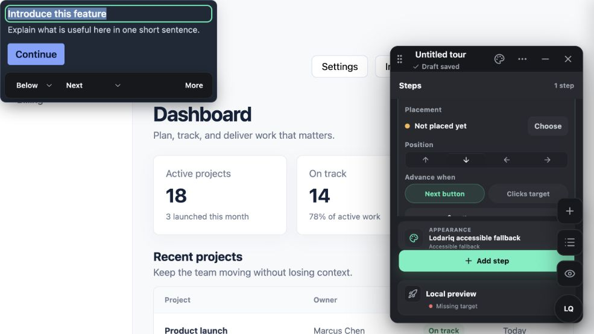
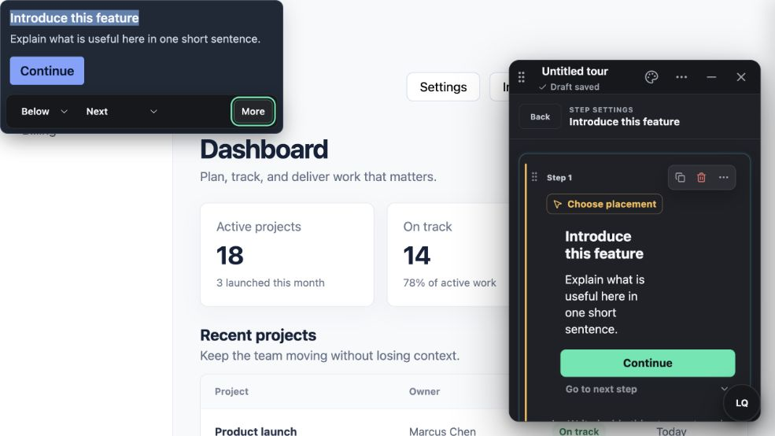
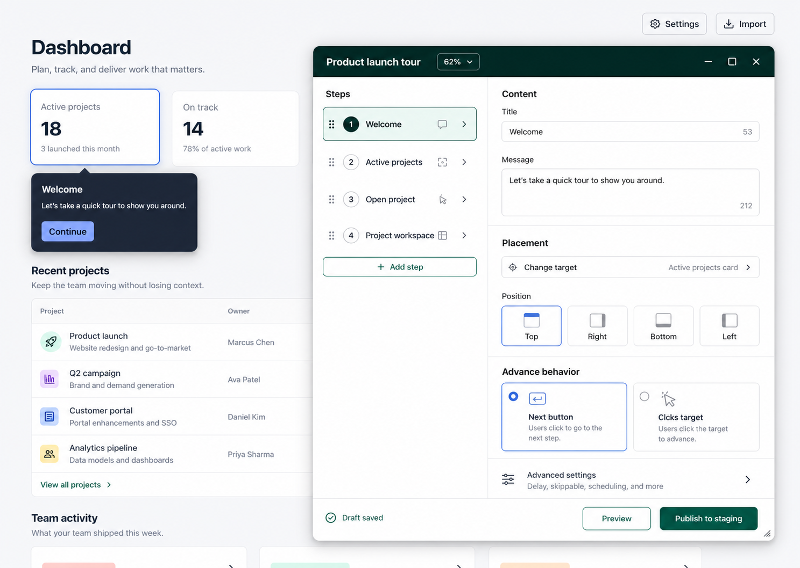
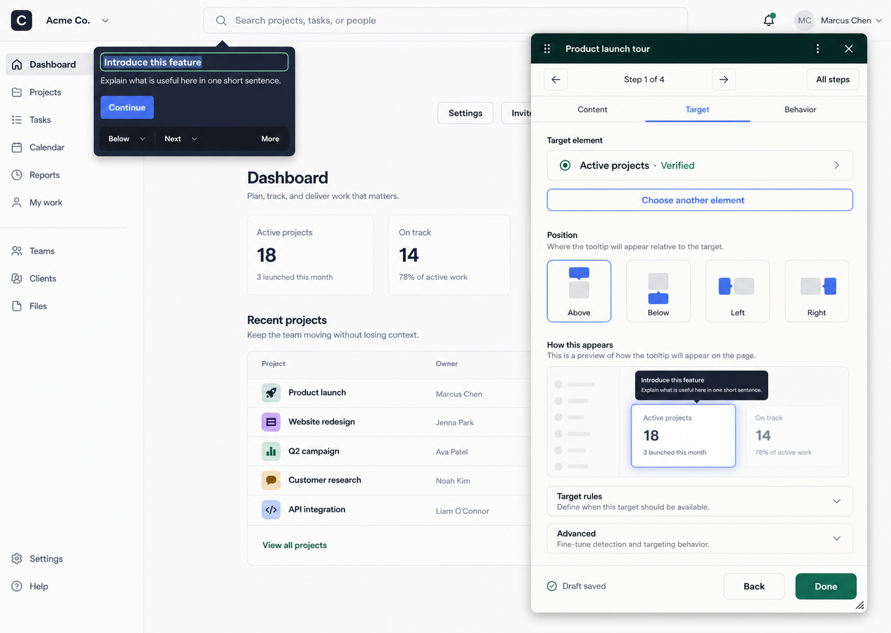
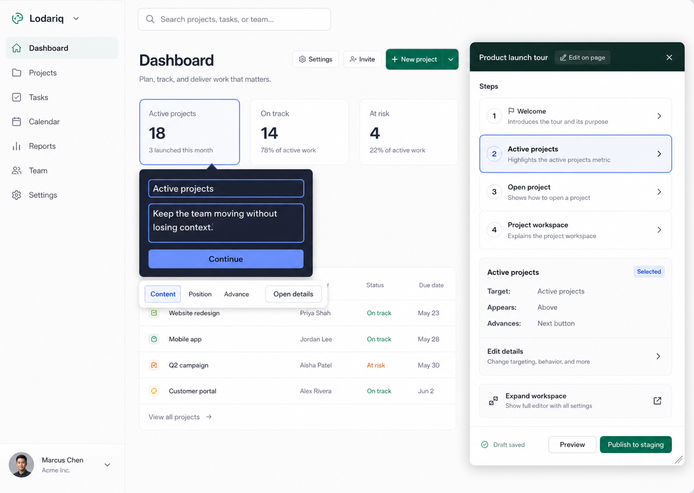

# Lodariq step-details UX audit

Date: 2026-08-09

## Scope

The in-product Tour authoring popup, specifically the default step overview and
the advanced step-details editor. The user goal is to create and validate a
multi-step Tour without losing the customer-page context.

## Evidence

### 1. Default step overview — strained

The modeless placement and live customer-page preview are strong. Draft state is
visible, and the creator can reach the main placement and advance controls.
However, the fixed 320px popup combines step navigation, placement, position,
advance behavior, appearance, step creation, validation, and release state.
These concerns compete instead of forming a clear editing sequence.

### 2. Advanced step settings — poor

Opening `More` replaces the overview with a deep content composer inside the
same narrow surface. Ordinary copy wraps into many short lines, the relationship
to placement and behavior becomes harder to follow, and several actions depend
on small icon-only controls. The on-page editor and panel editor also duplicate
some responsibilities.

## Strengths

- The customer product remains visible and interactive outside Lodariq chrome.
- The popup is draggable and its visual separation from customer-themed content
  is clear.
- Autosave, target health, and the live tooltip preview are useful reassurance.
- Keyboard focus is visibly styled on the inspected controls.

## UX risks

- The default width is hard-coded to 320px, which is too small for the current
  information architecture and offers no visible resize action.
- Global experience settings, step settings, content editing, placement,
  validation, and release controls appear in the same compact hierarchy.
- Similar-looking cards, rows, icon buttons, accordions, dropdowns, and floating
  actions do not consistently communicate what is clickable or what will open.
- `More` is an underspecified label for a major context switch into a much
  denser editor.
- Repeated popovers and expandable surfaces increase closure and focus-management
  demands while hiding the creator's current place in the workflow.

## Accessibility risks

- Several compact icon-only actions have weak visible affordance and may be
  difficult for low-vision, motor, or first-time users.
- Meaning conveyed by position or icon alone needs an accessible name and a
  persistent visible label for unfamiliar actions.
- Resize, drag, nested overlays, and focus restoration need keyboard and zoom
  testing; screenshots alone cannot confirm those behaviors.

## Recommendations

1. Add adaptive resizing and workspace modes. Start at 440–480px, allow a
   viewport-clamped 360–720px range, offer Compact, Standard, and Focus presets,
   and remember the session choice. At wider sizes, switch to a step-list plus
   inspector split layout.
2. Use progressive, task-based editing. Keep Content, Target, and Behavior as
   stable destinations and show only one task at a time on narrower widths.
   Move Appearance and Release out of step details.
3. Make the canvas the primary editor. Keep direct copy editing on the rendered
   tooltip, attach a small labeled property bar, and use the popup for sequence,
   status, and concise properties. Provide an explicit `Expand workspace`
   action for deep editing.
4. Standardize affordances. Use a single interactive-row pattern with a visible
   label, optional helper text, 44px minimum target, selected/hover/focus state,
   and a trailing chevron when it opens another surface. Reserve icon-only
   buttons for universally understood actions and always provide tooltips.
5. Keep state and primary actions stable. Use a sticky footer for save state,
   Preview, and one contextual release action; do not repeat them inside step
   cards or temporary menus.

## Visual concepts

### Adaptive split workspace

### Guided section inspector

### Canvas-first authoring

## Recommended direction

Combine Adaptive split workspace with Canvas-first authoring: make routine copy
and placement edits directly on the page, then let creators expand the popup
into a resizable split workspace for sequence and advanced work. Use Guided
section inspector as the narrow-width layout.
