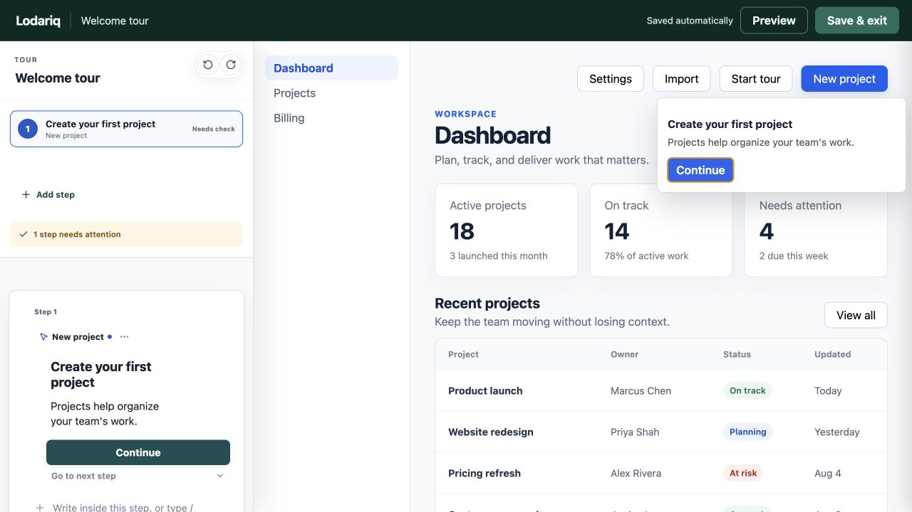
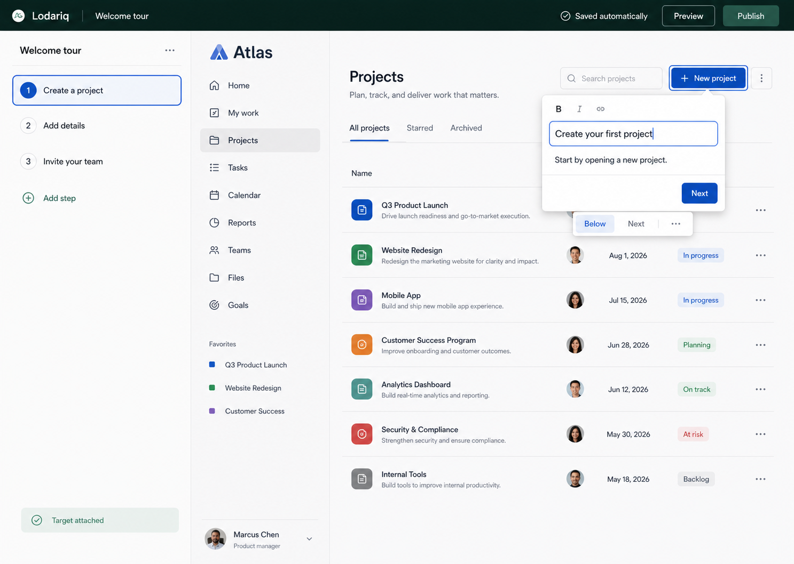
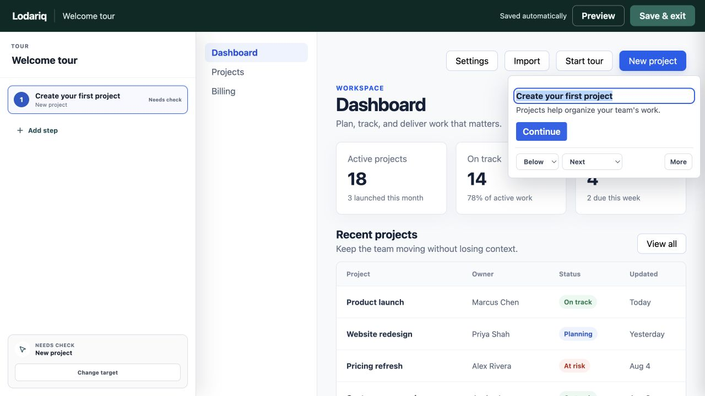
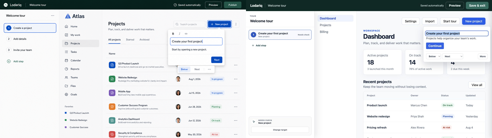

# Current Tour-Authoring UX Audit

Date: 2026-08-06
Status: **Historical content-authoring pass — hosted shell superseded by the
locally verified Slice 1 implementation**

The current cross-surface visual target is Option 2, **Editorial Air**, in
`../design-system-exploration-2026-08-06/README.md`. The screenshots below
remain evidence for the completed canvas-first behavior, not the selected
dashboard or hosted-shell styling.

## Scope

This audit compares the Phase 0/1 tour-authoring workspace before and after the
canvas-first correction against the selected authoring direction. The ordinary
creator journey is now:

```text
Add step -> choose target -> type in the rendered tooltip -> preview
```

## Canonical Shell Supersession

This audit remains evidence for removing the duplicated content form and making
the runtime-rendered experience the ordinary editor. Its full-width session bar
and fixed left dock are historical shell choices, however, and are not the
current canonical target.

The later Phase 2 Slice 1 convergence uses one permanent SDK install, a direct
draggable launcher in configured development/staging products, a first-party
top-level auth popup with an exact-origin single-use code exchange and scoped
activation/document session, and the same modeless authoring popup and runtime
overlay. `New`, `Experiences on this page`, and `Preview` remain stable; repair
and Phase 2 Brand/release actions are contextual. The dashboard is
setup/admin/support only, and the core workflow
requires neither a browser extension nor a second dashboard-installed creator
snippet. Phase 3 expands `New` into the broad outcome/type chooser.

That hosted convergence is implemented and locally verified separately. It is
not implemented or verified by the historical screenshots below. Slice 2's
Brand/staging implementation and its pending milestone/visual gate are tracked
in the current phase plan.

## Evidence

### 1. Previous implementation — form-first baseline



The active step was repeated in the rail, a persistent configuration form, and
the rendered tooltip. The form dominated the dock and taught creators to move
between configuration and result.

### 2. Historical direction — previous content-authoring target



The customer product is the editor. The dock is a compact sequence rail, common
controls stay beside the selected tooltip, and advanced configuration opens only
when requested.

### 3. Corrected implementation — canvas-first



The default dock now contains the experience name, compact step rows, `Add step`,
and selected-target health. The persistent content form is absent. The rendered
tooltip is the ordinary editor, with placement, action, and `More` controls in
context.

### 4. Final side-by-side review



The combined comparison passed independent visual review with no P0 or P1
structural gap. The different customer dashboard, one-step fixture, truthful
`Needs check` state, and `Save & exit` label are accepted scope differences.

## Workflow Outcome

| Concern           | Previous implementation                        | Corrected implementation                    |
| ----------------- | ---------------------------------------------- | ------------------------------------------- |
| Primary editor    | Persistent dock form                           | Rendered experience on the product          |
| Dock purpose      | Sequence plus duplicated content/configuration | Compact sequence, add action, target health |
| Common controls   | Repeated in the form                           | Contextual to the active tooltip            |
| Advanced controls | Always visible and scrollable                  | Opened deliberately through `More`          |
| Attention path    | Dock -> canvas -> dock                         | Canvas, with the rail as orientation        |
| New-step flow     | Create, then configure                         | Add step -> click target -> type            |

## Implemented Primary Journey

1. `Add step` creates the semantic step and immediately starts target selection;
   it does not open a blank form.
2. Clicking an eligible product element attaches its semantic fingerprint,
   renders the step beside it, and focuses/selects the heading for immediate
   typing.
3. Heading, body, button, and link labels edit directly in the runtime-rendered
   experience. Blur, Enter, or a short idle boundary produces a batched semantic
   commit; Escape restores the prior value.
4. Placement and common action stay in a small contextual toolbar. `More` flushes
   any active edit before opening the selected step's advanced settings.
5. Autosave persists canonical structured block JSON. Preview uses the runtime
   renderer; authoring affordances are reattached only while the creator session
   remains open.

## Interaction Budget

The budget counts pointer clicks, not typing or optional keyboard navigation.

| Creator task                                  | Ordinary-path clicks | Implemented route                        |
| --------------------------------------------- | -------------------: | ---------------------------------------- |
| Edit a visible heading, body, or action label |                    1 | Click rendered content, then type        |
| Save an ordinary edit                         |                    0 | Autosave                                 |
| Add and attach one tour step                  |                    2 | `Add step`, then target element          |
| Switch to a step and edit its content         |                    2 | Step row, then rendered field            |
| Change placement                              |                    2 | Contextual placement control, then value |
| Change a common action                        |                    2 | Contextual action control, then value    |
| Open advanced step settings                   |                    1 | `More`                                   |
| Change page for primary authoring             |                    0 | Stay on the customer product             |

## Verified Historical Content-Authoring Criteria

### Default hierarchy

- [x] The dock shows the experience name, compact step rows, `Add step`, and
      selected-target health, with no content form by default.
- [x] Heading, body, and action labels do not appear twice in the default view.
- [x] The rendered experience is the only ordinary content editor.
- [x] Placement, common action, and `More` sit beside the active experience.
- [x] Advanced controls are closed, absent from the default DOM, and excluded
      from the initial tab order.

### Behavior

- [x] Selecting a rail row previews that exact step without leaving the product.
- [x] `Add step` starts target selection and target attachment autofocuses the
      first meaningful editable field.
- [x] Heading, body, button, and link edits synchronize the rail, canonical JSON,
      preview, autosave, and reload state.
- [x] Runtime button/link actions are suppressed during label authoring; production
      runtime playback remains independent of the authoring package.
- [x] Placement and action changes require no dock scrolling or page transition.
- [x] Autosave requires no save click and retains its serialized retry/drain path.

### Contract and safety

- [x] Contextual controls use closed, runtime-validated semantic bridge messages;
      raw CSS, HTML, selectors, coordinates, and keystroke streams do not cross
      the iframe boundary.
- [x] Canonical state remains structured Lodariq block JSON.
- [x] Authoring controls and attributes are excluded from production runtime
      assets by bundle-boundary regression tests.
- [x] Preview and production playback use the runtime renderer; authoring-only
      enhancement is confined to authenticated creator sessions.

### Responsive and accessibility

- [x] Primary controls have accessible names, visible focus treatment, and status
      announcements; the accessibility smoke suite is green.
- [x] New target attachment moves focus into the tooltip; advanced controls are
      unreachable while closed.
- [x] Desktop keeps the customer product visible beside the rail, and the narrow
      layout preserves task order without horizontal overflow.
- [x] The Chromium, Firefox, and WebKit primary authoring/runtime journeys pass.

## Verification

- Manual in-app-browser journey: Add step -> choose a real product target ->
  heading autofocus -> direct edit -> placement -> `More` -> Back.
- Final combined visual review: pass, with no P0/P1 canvas-first mismatch.
- Cross-browser Playwright: 55 passed, 2 intentional dashboard skips.
- Focused direct-edit unit regression: 16 passed.
- Node 24 full `pnpm verify`: 38 unit/contract files and 350 tests passed, along
  with typecheck, lint, boundaries, migrations, production builds, bundle-size
  gates, SDK asset preparation, and a 0-vulnerability dependency audit.

Screenshots establish hierarchy and visual parity; behavioral claims above are
grounded in interaction and repository tests rather than inferred from images.
