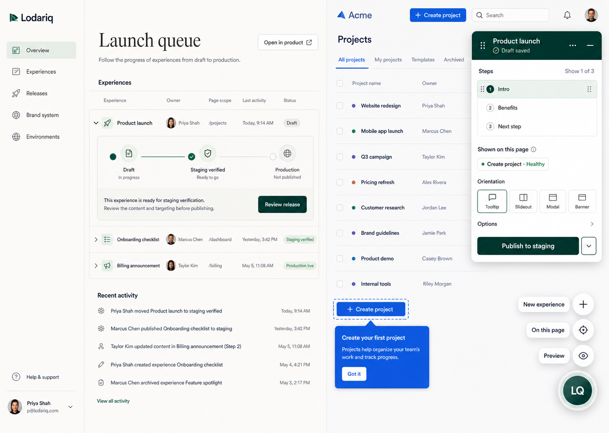

# Lodariq Design System Direction

Status: **Option 2 — Editorial Air is the current canonical visual direction as
of 2026-08-06**

Editorial Air is the current visual source of truth for the dashboard and the
hosted in-product authoring shell. It was selected because its hierarchy is
more organized and easier to understand at first glance. Implementation should
follow this direction until coded visual QA or usability evidence justifies a
documented change.

The PRD and phase plans remain authoritative for product behavior, security,
release semantics, and implemented scope. This decision controls visual
hierarchy, component language, and surface relationships; a generated image
does not make an unimplemented capability complete.

## Approved Direction

### One system, three visual layers

1. **Lodariq dashboard/admin UI** uses a light-first, calm control-plane
   language with opaque surfaces, clear hierarchy, and compact release truth.
2. **Lodariq creator chrome** uses restrained glass only for the draggable
   launcher, action palette, popup header, target-selection chip, and contextual
   menus. The popup body remains substantially opaque for reliable contrast on
   arbitrary host pages.
3. **Customer-themed runtime experiences** use the approved customer Brand
   System. Lodariq chrome may frame a rendered tooltip, modal, hotspot, or
   checklist, but must not recolor it with Lodariq tokens.

### Dashboard hierarchy

- On desktop, use a restrained left navigation that starts as an icon rail and
  expands on demand to show labels. Collapsing it must keep the destination
  icons, accessible names, current-location state, and a clear expand control.
- On mobile, replace the rail with a proper modal navigation drawer opened from
  the page header. Do not compress the destinations into a horizontal tab or
  scrolling navigation strip.
- Keep a single obvious page purpose in either navigation state.
- Use grouped rows, release queues, activity, and inline environment progress
  instead of a wall of generic summary cards.
- Put experience name, owner, page scope, last activity, and release state in
  one scannable structure.
- Expand the selected experience in place to show `Draft -> staging
publication/verification evidence -> production` and the derived next
  action. Use **Verified** only when a real verification record exists, and use
  **Live** only when the active production pointer proves it.
- Keep **Open in product** visible as a convenience, not as a required authoring
  gate.
- Move SDK installation, tokens, diagnostics, and support details into setup or
  progressive-disclosure surfaces. Do not stack those forms on the dashboard
  home.
- Do not use empty metrics, decorative charts, giant hero copy, or nested card
  grids merely to fill the page.

### In-product authoring hierarchy

- Keep the customer product dominant, visible, scrollable, and clickable.
- Use a small draggable launcher with three stable actions in this order:
  **New experience**, **Experiences on this page**, and **Preview as user**.
- Hover or focus may reveal the actions; click, tap, Enter, or Space pins them.
  Render them as compact icons with accessible names and short hover/focus
  tooltips. Every primary target is at least 44 by 44 CSS pixels. Pointer leave
  and action activation do not collapse a pinned dock; outside click, the
  launcher toggle, or `Escape` does.
- Open a compact draggable, modeless popup with a deep-evergreen glass header
  and a warm-white, high-contrast body. No backdrop, full-width bar, page resize,
  or permanent editor rail is allowed.
- Keep sequence when the experience is multi-step, a concise **Appears on**
  placement summary, and the derived release action in the popup. Hide matching
  strategy, confidence, selector/fingerprint data, interaction prerequisites,
  and removal behind explicit placement disclosure. Edit content directly in
  the rendered customer-themed experience.
- Collapse target selection to a movable chip, then restore the same draft,
  step, position, and focus.
- Show quiet autosave state and one contextual release action such as
  **Publish to staging**. Advanced Brand, repair, history, and support controls
  appear only when relevant.

### Current implementation scope

The dashboard and draggable modeless authoring popup have an Editorial Air
implementation in code and the Slice 1 consolidated local milestone gate
passes; same-viewport Design QA remains pending. The dashboard navigation
defaults to the desktop icon rail and uses the mobile drawer described above;
the static Editorial Air image's permanently expanded rail is illustrative rather than a
requirement. Local and hosted creator modes implement the canonical three-action
icon dock, a Tour-only type picker backed by distinct drafts, and an in-product
page/workspace browser. The hosted two-action compatibility UI is no longer the
primary path; schema-only future types remain absent.

The verified Slice 1 gate covers hosted activation/session code and interactions.
Slice 2 now implements document-specific delivery, Brand persistence/approval,
tokenized Tour rendering, deterministic basic preflight, release state, and
guarded staging publication locally, but its consolidated milestone gate and
same-viewport visual parity are still pending. Neither checkpoint proves
deployed first-party auth, real-browser staging verification, production
promotion/approval, rollback/unpublish, analytics isolation, or an active
production-live pointer.

## Directional Tokens

These values are the starting token system for implementation. Contrast,
cross-platform rendering, and arbitrary-host legibility must be verified before
they are frozen.

| Role                                | Starting value |
| ----------------------------------- | -------------- |
| Warm canvas                         | `#F8F7F2`      |
| Opaque surface                      | `#FFFFFF`      |
| Primary ink                         | `#202522`      |
| Deep evergreen chrome               | `#0C211C`      |
| Brand action                        | `#0B6655`      |
| Sage supporting state               | `#4D7869`      |
| Muted text                          | `#63716D`      |
| Hairline border                     | `#D8E3DF`      |
| Focus and semantic target selection | `#376BFF`      |
| Attention only                      | `#C96047`      |

- Typography: Plus Jakarta Sans for dashboard and authoring UI. A restrained
  editorial display face may be tested only for large dashboard page headings;
  authoring and dense operational text stay sans-serif.
- Spacing scale: `4, 8, 12, 16, 24, 32, 40` pixels.
- Radius scale: `8px` controls, `12px` groups, `16px` floating surfaces, and
  pill radius only for compact statuses or the launcher.
- Density: comfortable 48–52px dashboard rows and compact 36–40px secondary
  authoring controls, while primary interactive targets remain at least 44px.
- Iconography: one consistent rounded line-icon family. Use a custom Lodariq
  mark only after a real brand asset is approved.
- Elevation: quiet borders in the dashboard; a two-layer shadow plus inner edge
  highlight for floating creator chrome.
- Motion: short, restrained reveals and position changes with reduced-motion
  support; no bounce or continuous decorative animation.

## Illustrative, Not Approved

The selected image does **not** approve:

- the generated `LQ` monogram or any other invented logo;
- exact copy, avatars, fixture data, customer-product styling, or fixed screen
  coordinates;
- a permanent split-screen dashboard/customer-product layout;
- authoring in production;
- experience types or release capabilities that the current phase has not
  implemented;
- arbitrary CSS, raw HTML, customer stylesheet copying, or Lodariq colors in
  customer-themed runtime content.

## Compatibility-Shell Acceptance

The current coded pass should be considered aligned only when:

- the dashboard is understandable without relying on a summary-card wall or an
  authoring launch form;
- a creator can discover and operate the truthful actions by mouse and
  keyboard, pin the dock without hover, and keep it open across pointer leave
  and action activation, with touch evidence completed before claiming the
  cross-input gate;
- the launcher, popup, and target-selection chip are draggable, viewport-safe,
  and modeless;
- the host page remains usable outside Lodariq's visible bounds;
- customer-themed experience content is visually distinct from Lodariq creator
  chrome;
- release state and the next action are legible in both dashboard and authoring
  contexts without duplicate configuration;
- the implementation is compared directly with the selected image at the same
  viewport and corrected through visual QA.

Phase 2 Slice 1 code and interaction acceptance is locally verified. Slice 2's
Brand/staging implementation is present but not yet milestone-verified. Final
Editorial Air acceptance still requires the same-viewport comparison and
external usability evidence; full Phase 2 additionally requires product
matching, exact staging browser verification, production promotion/approval,
rollback/unpublish, and analytics isolation.

## Decision History

- [Option 1 — Signal Glass](./01-signal-glass.png) remains an exploration of a
  dark, release-confidence-heavy direction.
- [Option 2 — Editorial Air](./02-editorial-air.png) is the current canonical
  direction.
- [Option 3 — Prism Control](./03-prism-control.png) remains an exploration of a
  compact, high-contrast release canvas.
